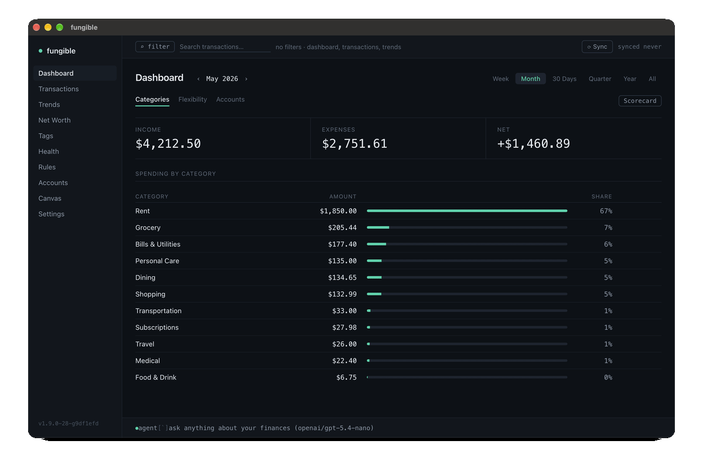
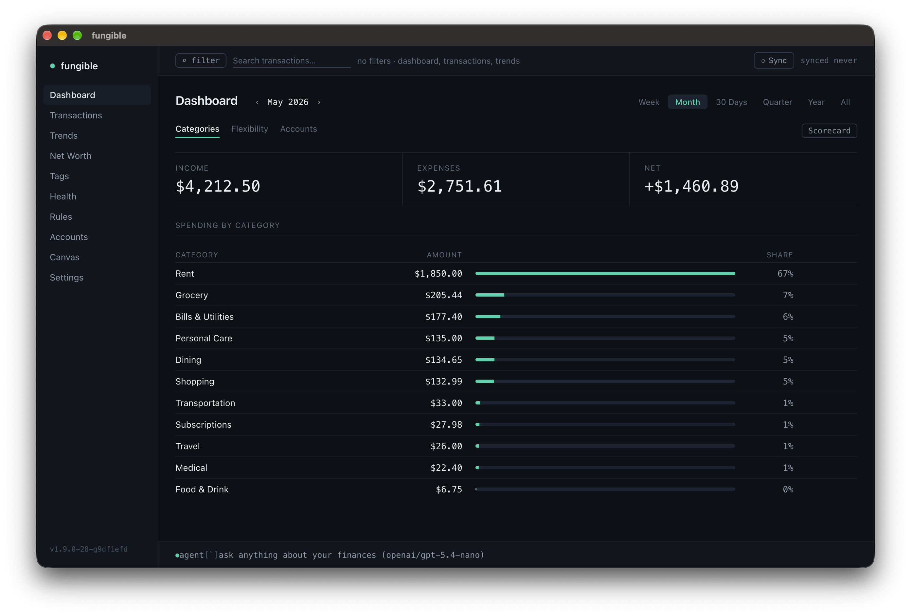
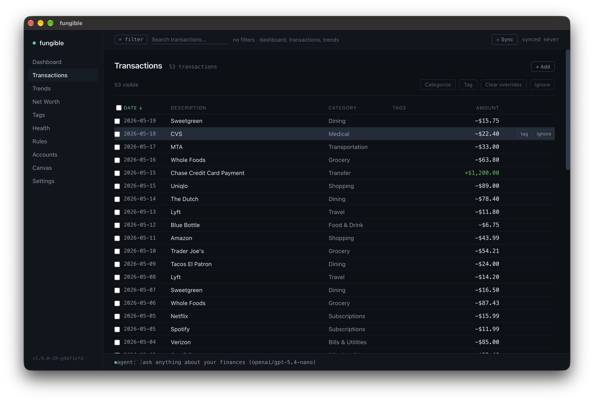
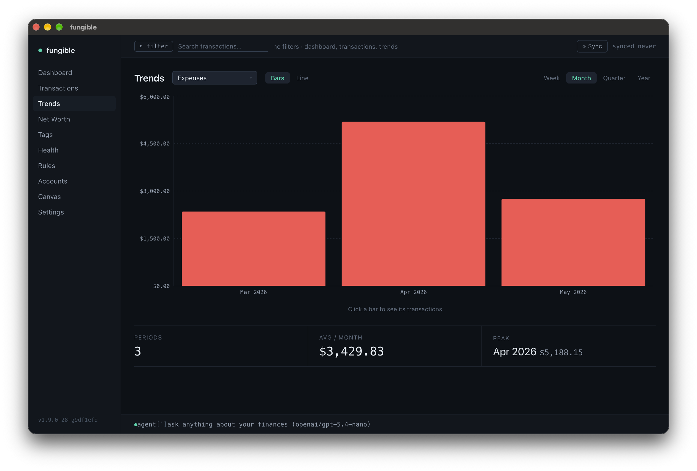
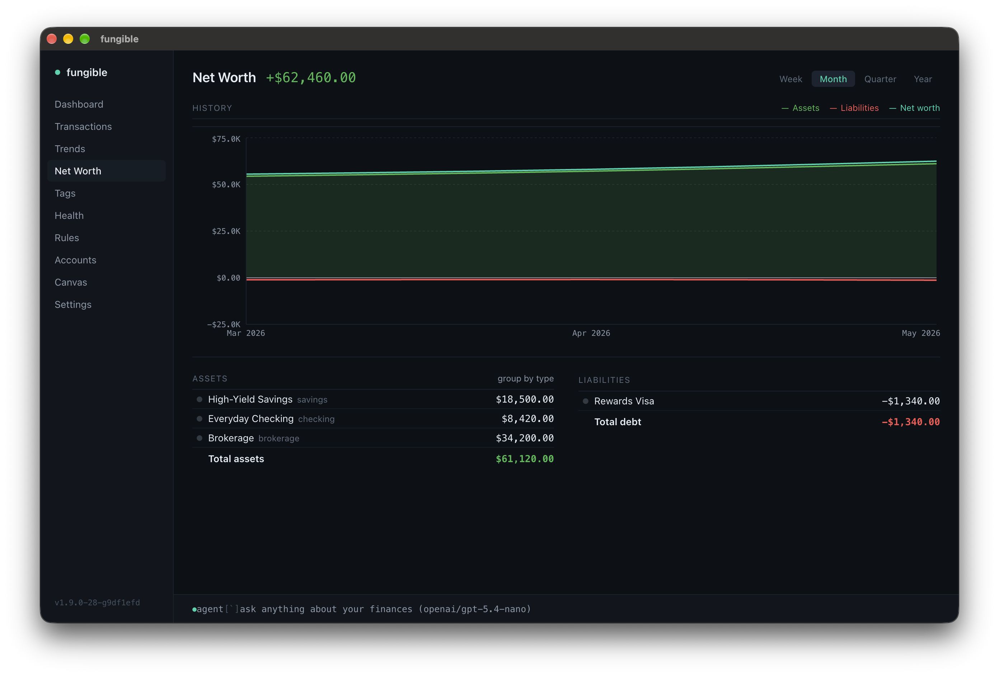
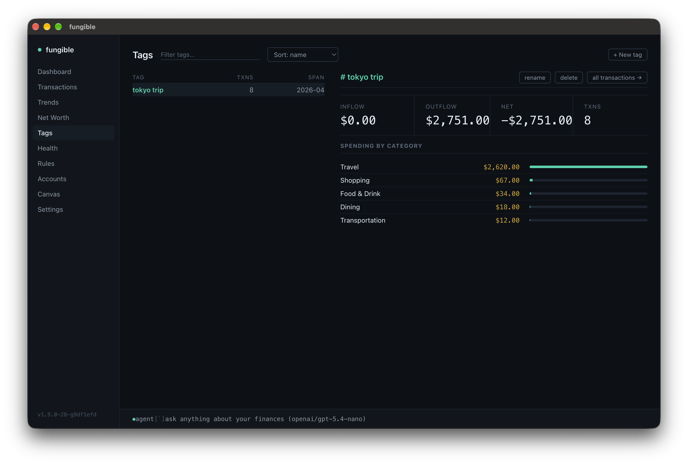
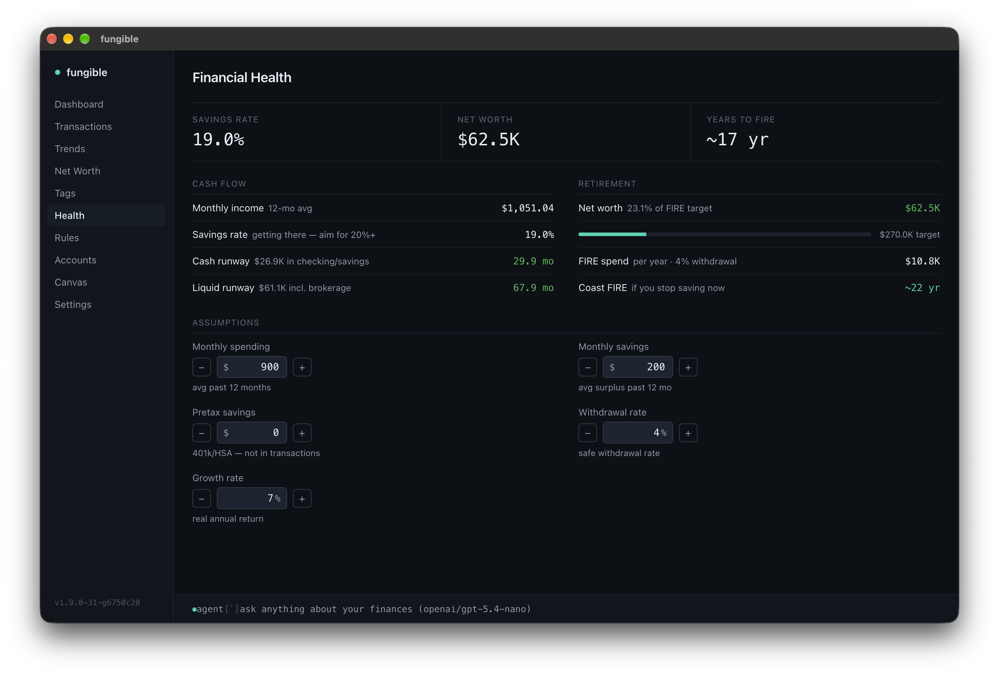
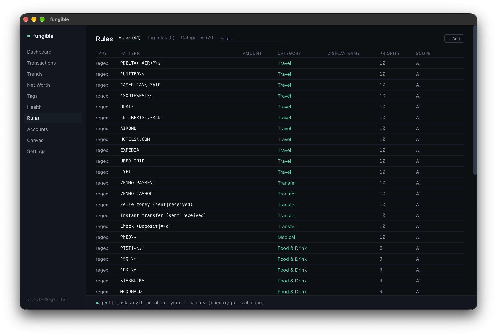
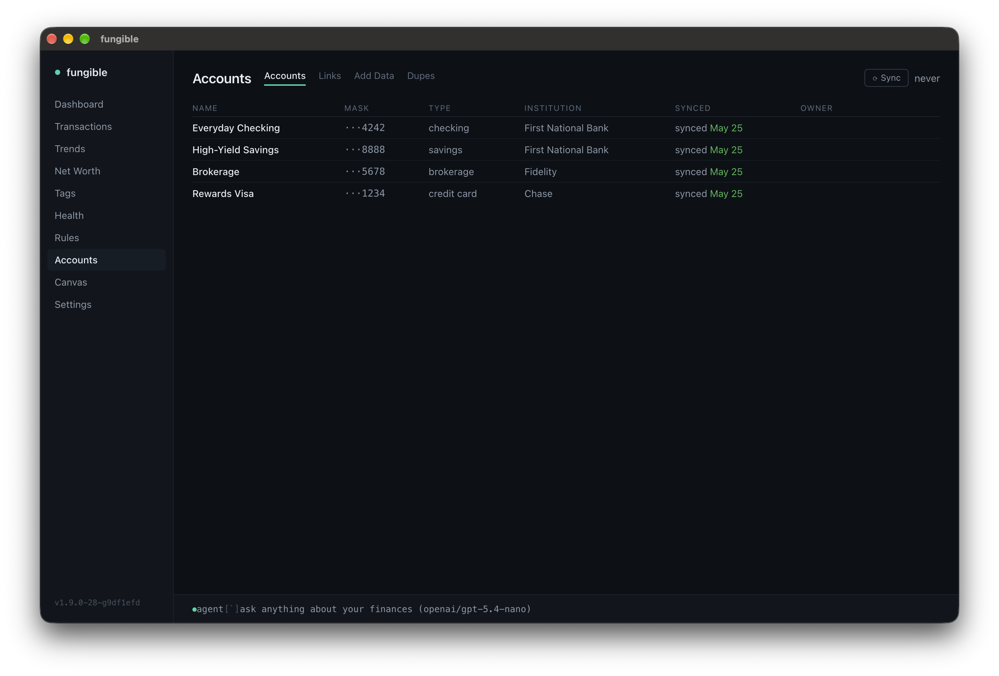

[](https://github.com/tomfunk/fungible/actions/workflows/ci.yml)

Personal finance, keyboard-first. Available as a **terminal UI** or a **desktop app** — both running over the same local data: Plaid sync, CSV import, categorize, tag, search, analyze. Plus an MCP server so Claude can read and manage it for you.




<details>
<summary>Screenshots</summary>

### Terminal UI

| | |
|---|---|
|  |  |
|  |  |
|  |  |
|  |  |

### Desktop GUI

| | |
|---|---|
|  |  |
|  |  |
|  |  |
|  |  |

</details>

## Features

- **Plaid sync** — connect bank accounts and pull transactions automatically; 15-min debounce with force-sync option
- **CSV import** — import statement exports from any bank with flexible column mapping
- **Manual assets** — track a house, car, or other asset by name and value
- **Category & name rules** — substring or regex rules that auto-categorize and rename transactions; survives re-syncs
- **Spending flexibility** — tag categories as fixed / flexible / discretionary; see breakdown on Dashboard
- **Delta mode** — per-category spending deltas vs prior period, same period last year, and 12-month rolling average; heat-map coloring
- **Tags** — label transactions across accounts (trips, projects, events) and view summaries by tag
- **Net worth** — balance history with asset/liability breakdown; by account or by type
- **Financial health** — cash and liquid runway, FIRE number and progress, years to retirement with adjustable assumptions
- **Trends** — bar charts for expenses, income, net, or any category; per-range aggregation
- **Regex search** — shared across Dashboard, Transactions, and Trends
- **Dedup review** — review and remove CSV transactions that duplicate Plaid imports
- **MCP server + HTTP API** — Claude (or any script) can read and manage your finances
- **Daily backups** — kept at `~/.fungible/backups/`, last 7 by default (configurable via `FUNGIBLE_BACKUP_DAYS`)

## Try it (no account needed)

```bash
fungible --demo
```

Spins up a fully pre-loaded instance with fake accounts, transactions, tags, and rules — completely isolated from any real data. Good for exploring before connecting a bank.

In the desktop app, pick **"Try Demo Mode"** from the app menu (macOS) or Help menu (Windows/Linux) — the app relaunches with the same isolated demo dataset.

## Install

### Terminal UI

**Homebrew (recommended)**

```bash
brew tap tomfunk/fungible
brew install fungible
fungible --setup     # first-time setup wizard
fungible --version   # print installed version
fungible
```

**From source** (Node.js 22+, also works on Linux/WSL)

```bash
git clone https://github.com/tomfunk/fungible
cd fungible
npm install
npm run dev -- --setup   # first-time setup
npm run dev
```

### Desktop GUI

Download an installer from the [latest release](https://github.com/tomfunk/fungible/releases/latest) (macOS arm64, Windows x64, Linux x64), or run from source:

```bash
npm install
npm run gui
```

The GUI reads/writes the same `~/.fungible/` database as the TUI — switch freely.

For first-launch caveats on the un-notarized installers (Gatekeeper, SmartScreen) and packaging details, see [`docs/gui.md`](docs/gui.md).

### Storage

Data and config live at `~/.fungible/` (override with `$FUNGIBLE_DATA_DIR`). Plaid access tokens are encrypted at rest using a key file at `~/.fungible/key` — do not delete this file or you will need to re-link your accounts. A free [Plaid](https://plaid.com) developer account (sandbox tier) is enough.

## Running

| Command | What starts |
|---------|-------------|
| `fungible` | TUI + MCP server (HTTP, port 3741) + REST API (port 3456) |
| Fungible.app (GUI) | Electron window only — MCP/API not auto-started |
| `fungible mcp` | stdio MCP server only — use this in your Claude Desktop config |
| `fungible api` | REST API server only |

`FUNGIBLE_MCP_PORT` and `FUNGIBLE_API_PORT` (in `~/.fungible/.env`) override the defaults.

## Screens

| Key | Screen |
|-----|--------|
| `0` | Settings |
| `1` | Dashboard |
| `2` | Transactions |
| `3` | Trends |
| `4` | Net Worth |
| `5` | Tags |
| `6` | Financial Health |
| `7` | Rules |
| `8` | Accounts |
| `9` | Canvas |

Full per-screen keybindings: [`docs/keybindings.md`](docs/keybindings.md).

## Docs

- [`docs/keybindings.md`](docs/keybindings.md) — per-screen keyboard reference
- [`docs/integrations.md`](docs/integrations.md) — HTTP API and MCP server setup, full tool list
- [`docs/gui.md`](docs/gui.md) — desktop app install, packaging, release flow
- [`CONTRIBUTING.md`](CONTRIBUTING.md) — branching policy, tests, PRs
