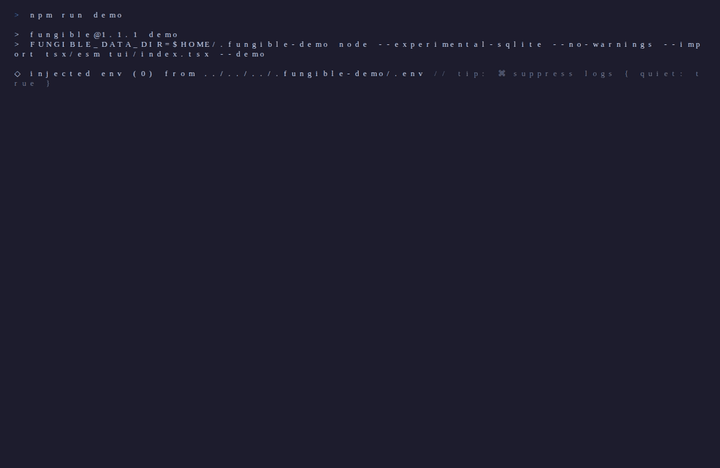
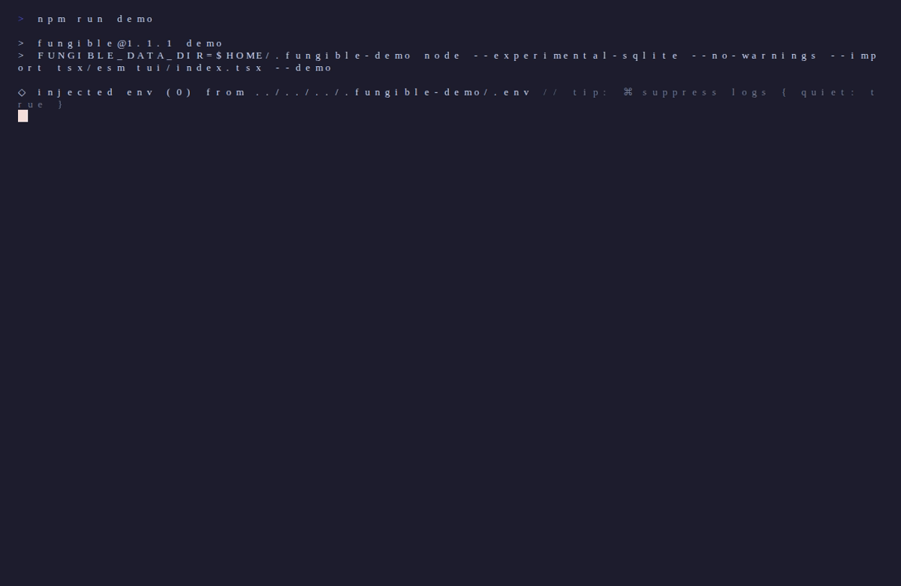
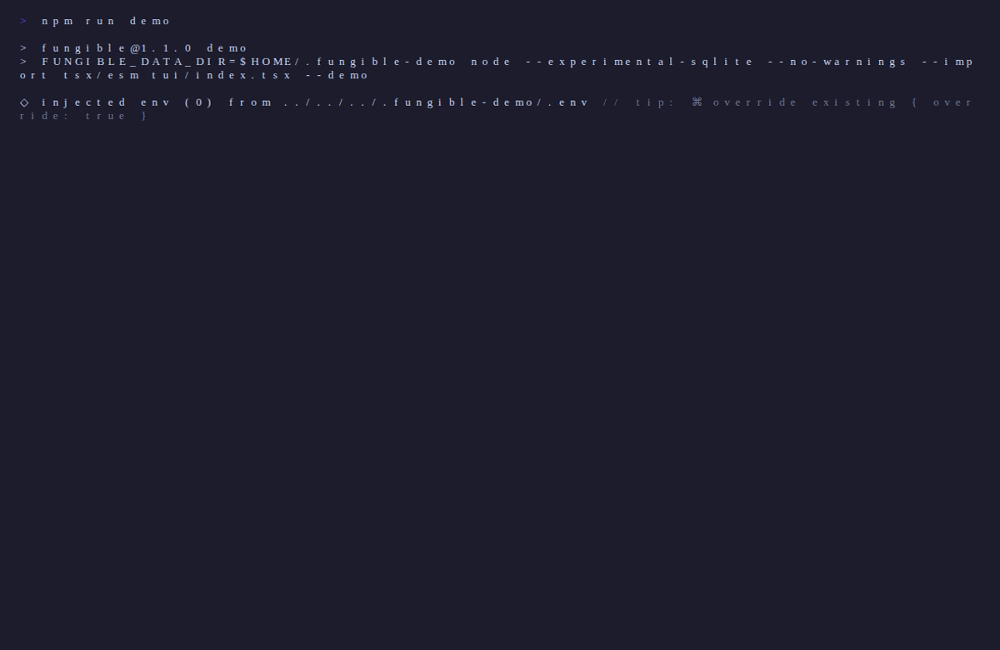

[](https://github.com/tomfunk/fungible/actions/workflows/ci.yml)

A terminal UI for personal finance. Syncs transactions from [Plaid](https://plaid.com/docs/quickstart/), imports CSVs, and lets you categorize, search, tag, and analyze spending — all from the keyboard.



<details>
<summary>Screenshots</summary>

| | |
|---|---|
|  |  |
|  |  |
|  |  |
|  |  |

</details>

## Features

- **Plaid sync** — connect bank accounts and pull transactions automatically; 15-min debounce with force-sync option
- **CSV import** — import statement exports from any bank with flexible column mapping
- **Manual assets** — track a house, car, or other asset by name and value
- **Category rules** — substring and regex rules that auto-categorize transactions, with optional amount filters
- **Name rules** — rename how transactions display, with optional amount filters
- **Spending flexibility** — tag categories as fixed / flexible / discretionary; view breakdown on Dashboard
- **Manual edits** — pin a category or display name to a specific transaction; survives re-syncs
- **Ignore** — soft-hide transactions from totals (transfers, reimbursements, etc.)
- **Hidden categories** — exclude categories like Transfer from all totals and charts
- **Tags** — label transactions across accounts (trips, projects, events) and view summaries by tag
- **Net worth** — balance history with asset/liability breakdown; view by account or by type; scroll by week, month, quarter, or year
- **Financial health** — cash and liquid runway, FIRE number and progress, years to retirement with adjustable assumptions
- **Dedup review** — review and remove CSV transactions that duplicate Plaid imports
- **Time ranges** — view Dashboard by week, month, quarter, year, or all time
- **Trends** — bar charts for expenses, income, net, or any category; per-range aggregation (week / month / quarter / year)
- **Delta mode** — toggle on Dashboard to see per-category spending deltas vs prior period, same period last year, and 12-month rolling average; heat-map coloring by deviation
- **Regex search** — `/` on Dashboard or Transactions filters by name using a regular expression; search is shared when navigating between Dashboard, Transactions, and Trends
- **MCP server** — Claude can read and manage your finances via the Model Context Protocol
- **HTTP API** — REST-style API server for scripting and automation

## Try it (no account needed)

```bash
fungible --demo
```

Spins up a fully pre-loaded instance with fake accounts, transactions, tags, and rules — completely isolated from any real data. Good for exploring all the screens before connecting a bank.

## Install

### Homebrew (recommended)

```bash
brew tap tomfunk/fungible
brew install fungible
fungible --setup   # first-time setup wizard
fungible
```

### From source

Requires Node.js 22+.

```bash
npm install
npm run dev
```

On first run, use `--setup` to configure credentials:

```bash
npm run dev -- --setup
```

Data and config are stored at `~/.fungible/`. Plaid access tokens are encrypted at rest using a key file at `~/.fungible/key` — do not delete this file or you will need to re-link your bank accounts. You'll need a free [Plaid](https://plaid.com) developer account to sync bank transactions (sandbox tier works).

## Turso sync (optional)

By default, fungible stores everything in a local SQLite file at `~/.fungible/fungible.db`. It is fully self-contained — no cloud account needed.

If you want **automatic backup and cross-device sync**, you can point fungible at your own [Turso](https://turso.tech) database. Turso is a cloud SQLite service with a generous free tier. fungible stays local-first: all reads and writes go to the local file, and Turso mirrors it silently in the background.

**Setup (one time):**

1. Sign up at [turso.tech](https://turso.tech) and install the CLI: `brew install tursodatabase/tap/turso`
2. Create a database: `turso db create fungible`
3. Get the URL: `turso db show fungible --url`
4. Generate a token: `turso db tokens create fungible`
5. Add both to `~/.fungible/.env`:

```
FUNGIBLE_TURSO_URL=libsql://fungible-<your-name>.turso.io
FUNGIBLE_TURSO_TOKEN=<token>
```

Or run `fungible --setup` and answer yes when asked about Turso.

**Cross-device:** on a second machine, install fungible, add the same two env vars, and run it. It will pull your full database from Turso on first launch. From then on, both machines stay in sync automatically.

**No lock-in:** removing the env vars reverts to local-only mode. Your local `fungible.db` is always a complete, readable SQLite file.

## Screens

| Key | Screen |
|-----|--------|
| `1` | Dashboard |
| `2` | Transactions |
| `3` | Trends |
| `4` | Net Worth |
| `5` | Tags |
| `6` | Financial Health |
| `7` | Rules |
| `8` | Accounts |
| `q` | Quit |
| `Esc` | Back / clear filter |

## Key bindings

### Dashboard `[1]`

| Key | Action |
|-----|--------|
| `r` | Cycle time range (Week → Month → Quarter → Year → All Time) |
| `← →` | Previous / next period |
| `Tab` | Cycle views: Categories → Flex → Account picker |
| `↑ ↓` | Select category (Categories view) or account (Account view) |
| `Enter` | Drill into transactions for selected category / account |
| `Space` | Toggle account filter (Account view) |
| `c` | Clear account filter |
| `d` | Toggle delta mode (spending vs prior period / same period last year / 12-month avg) |
| `/` | Search transactions by name (regex); filters category totals live |

In **Categories** view, spending is broken down by category with bar charts. In **Flex** view, spending is grouped by flexibility tier (fixed / flexible / discretionary / untagged). In **Account** view, select an account to filter all dashboard data to that account.

In **delta mode**, the bar chart is replaced by three delta columns — vs prev period, vs same period last year, and vs 12-month rolling average — color-coded green / yellow / red by deviation. Not available for the All Time range. An active search carries through when switching to Transactions (`2`) or Trends (`3`).

### Transactions `[2]`

| Key | Action |
|-----|--------|
| `↑ ↓` | Navigate |
| `← →` | Previous / next month (when date filter active) |
| `s` | Cycle sort: Date ↓↑ → Description ↑↓ → Amount ↓↑ → Category ↑↓ |
| `/` | Search by name (regex); inherited from Dashboard if navigated with an active search |
| `a` | Show all transactions |
| `u` | Show uncategorized only |
| `e` | Edit: rename display name or change category |
| `g` | Tag panel: add/remove tags on selected transaction |
| `G` | Tag all visible transactions at once (use `/` to filter first) |
| `c` | Undo manual category override |
| `i` | Ignore / un-ignore selected transaction |
| `x` | Delete selected transaction (CSV-imported only) |
| `Esc` | Clear active filter (peels off one at a time) |

### Trends `[3]`

| Key | Action |
|-----|--------|
| `Tab` | Cycle views: Expenses → Income → Net → [each category] |
| `↑ ↓` | Navigate periods |
| `r` | Cycle aggregation range (Week / Month / Quarter / Year) |
| `Enter` | Drill into transactions for selected period |

### Net Worth `[4]`

| Key | Action |
|-----|--------|
| `Tab` | Toggle: by account ↔ by type |
| `r` | Cycle history range (Week / Month / Quarter / Year) |
| `↑ ↓` | Scroll history |

Shows assets (depository, investment, manual), liabilities (credit), and net worth. History shows one snapshot per period (last sync within each bucket), scrollable with up/down.

### Tags `[5]`

| Key | Action |
|-----|--------|
| `↑ ↓` | Select tag |
| `/` | Search tags |
| `Enter` | Open tag detail (income / expenses / category breakdown) |
| `t` | View all transactions for selected tag |
| `a` | Add new tag |
| `n` | Rename selected tag |
| `x` | Delete selected tag |

In tag detail, `↑ ↓` selects a category and `Enter` drills into transactions for that tag + category. `← →` cycles to the previous/next tag.

### Financial Health `[6]`

Displays a full financial picture across four sections:

- **Snapshot** — savings rate (color-coded) and estimated monthly income
- **Runway** — months of cash and liquid coverage at current spending
- **Debt** — net cash position (checking minus credit debt), months to debt-free at current savings rate (hidden if no debt)
- **Retirement** — net worth, FIRE number with progress bar, Coast FIRE (years until growth alone covers retirement if you stop saving now), estimated years to FIRE

| Key | Action |
|-----|--------|
| `↑ ↓` | Select assumption dial |
| `← →` | Adjust selected dial value |
| `r` | Reset selected dial to default |

**Dials:** Monthly spending (±$100, default = avg past 12 months), Monthly savings (±$100, default = avg surplus), Withdrawal rate (±0.5%, default = 4%), Growth rate (±1%, default = 7%).

Liquid assets = cash + brokerage (excludes 401k, IRA, pension).

### Rules `[7]`

Three sections, cycle with `Tab`: **Category Rules**, **Name Rules**, **Categories**.

**Category Rules / Name Rules:**

| Key | Action |
|-----|--------|
| `/` | Search rules |
| `a` | Add rule |
| `e` / `Enter` | Edit selected rule |
| `x` | Delete selected rule |

Category rules support substring and regex matching with optional min/max amount filters. Name rules support the same matching plus optional amount filters.

**Categories:**

| Key | Action |
|-----|--------|
| `a` | Add new category |
| `n` | Rename category (cascades to all transactions, rules, and hidden settings) |
| `x` | Delete category (resets affected transactions to Uncategorized) |
| `v` | Toggle hidden (hidden categories are excluded from totals) |
| `f` | Cycle flexibility tier: none → fixed → flexible → discretionary |

### Accounts `[8]`

| Key | Action |
|-----|--------|
| `Tab` | Cycle views: Accounts → Add Data → Dupes |
| `↑ ↓` | Select account |
| `e` | Edit account type / subtype |
| `n` | Set or clear a nickname (shown in place of the bank-assigned name) |
| `v` | Update value (manual assets only) |
| `r` | Repair Plaid link for selected account |
| `s` | Force sync (bypasses 15-min cooldown) |
| `x` | Delete selected account |
| `l` | Link a new bank account via Plaid |

**Add Data** options: `[l]` link bank via Plaid, `[c]` import CSV, `[m]` add manual asset (house, car, etc.), `[s]` force sync.

**Dupes** tab shows CSV transactions that match Plaid imports. `[x]` deletes the selected CSV duplicate; `[X]` deletes all.

## Scripts

```bash
# Link a new bank account via Plaid (also available from Accounts screen)
npm run link

# Import a CSV file
npm run import-csv /path/to/file.csv

# Seed default category rules
npm run seed-rules
```

## HTTP API

Exposes the same tools as the MCP server over HTTP — useful for scripting and automation.

```bash
npm run api
# Listening on http://localhost:3456
```

**Endpoint:** `POST /tools/:name` with a JSON body.

```bash
curl -X POST http://localhost:3456/tools/spending_summary \
  -H "Content-Type: application/json" \
  -H "Authorization: Bearer <key>" \
  -d '{"year": 2026, "month": 5}'
```

**Configuration** (in `~/.fungible/.env`):

| Variable | Default | Description |
|----------|---------|-------------|
| `FUNGIBLE_API_KEY` | _(none)_ | Bearer token required on all requests. If unset, auth is skipped (dev only). |
| `FUNGIBLE_API_PORT` | `3456` | Port to listen on. |

Available tools: same set as the MCP server below.

## MCP Server

Exposes your financial data to Claude via the [Model Context Protocol](https://modelcontextprotocol.io).

```bash
npm run mcp
```

Available tools:

| Tool | Description |
|------|-------------|
| `spending_summary` | Income, expenses, and breakdown by category for a given month |
| `list_transactions` | Search and filter transactions |
| `edit_transaction` | Rename display name or change category |
| `clear_edit` | Remove a manual category or name override |
| `ignore_transaction` | Ignore / un-ignore a transaction |
| `list_rules` | List category rules |
| `add_rule` | Add a category rule |
| `delete_rule` | Delete a category rule |
| `list_name_rules` | List name rules |
| `add_name_rule` | Add a name rule |
| `delete_name_rule` | Delete a name rule |
| `list_hidden_categories` | List hidden categories |
| `toggle_hidden_category` | Show or hide a category |
| `list_accounts` | List connected accounts |
| `sync` | Pull latest transactions from Plaid |
| `uncategorized_summary` | Most common uncategorized transaction names |
| `list_tags` | List tags with transaction counts |
| `tag_summary` | Income / expenses / category breakdown for a tag |
| `tag_transaction` | Add or remove a tag on a transaction |
| `get_balances` | Current balances, net worth, total cash and liquid |
| `get_financial_health` | Runway, FIRE number, years to retirement |
| `get_drift` | Per-category spending deltas vs prior period, last year, and 12-month avg |
| `get_trends` | Month-by-month spending trends for the last N months |
| `get_finance_guide` | Opinionated personal finance guidance by topic |

Add to your Claude config (`~/Library/Application Support/Claude/claude_desktop_config.json`):

**If installed via Homebrew:**
```json
{
  "mcpServers": {
    "fungible": {
      "command": "/opt/homebrew/bin/node",
      "args": ["--experimental-sqlite", "--no-warnings", "--import", "tsx/esm", "/opt/homebrew/lib/node_modules/fungible/mcp/server.ts"]
    }
  }
}
```

**If running from source:**
```json
{
  "mcpServers": {
    "fungible": {
      "command": "node",
      "args": ["--experimental-sqlite", "--no-warnings", "--import", "tsx/esm", "/path/to/fungible/mcp/server.ts"]
    }
  }
}
```
